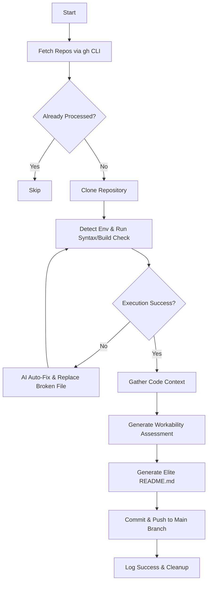

<div align="center">


# 🚀 Autonomous AI Coder Agent

An elite, multi-model Autonomous AI Software Engineer designed to discover, analyze, auto-fix, and automatically update GitHub repositories using advanced Large Language Models (LLMs).

[](https://opensource.org/licenses/MIT)
[](https://www.python.org/downloads/)
[](https://github.com/features/copilot)

</div>

## 📖 About
The **Autonomous AI Coder Agent** is a cutting-edge script that acts as your robotic DevOps engineer and senior developer. It continuously pulls target repositories, rigorously checks execution and syntax (Python, Node.js), and employs an array of AI models—including OpenAI, HuggingFace, and G4F—in a robust fallback cascade to intelligently debug and auto-fix execution errors. Once verified, it automatically generates a professional, repository-specific README and safely force-pushes the robust updates back to the `main` branch. 

Ideal for maintaining large-scale automation, scaling open-source contributions, and keeping dormant repositories functional and modern!

## ✨ Key Features
- **Multi-Model AI Cascade:** Integrates with OpenAI, AiHubMix, HuggingFace, and G4F (gpt-4o, claude-3.5-sonnet, gemini-1.5-pro, llama-3.1).
- **Execution & Syntax Verification:** Automatically detects Node.js (`package.json`) and Python ecosystems, triggering relevant builds, checks, and syntax tests.
- **Self-Healing Auto-Fix Loop:** If a repository fails compilation or execution, the agent reads the context and sends the trace to the AI for a self-healing patch.
- **Intelligent Documentation Generation:** Uses AI to generate objective, high-quality, SEO-optimized `README.md` files based entirely on the actual codebase.
- **Safe CI/CD & Git Automation:** Safely clones, commits, and utilizes `git push --force-with-lease` for maintaining an autonomous update loop.

## ⚙️ Architecture & How It Works



## 🛠️ Installation & Setup

1. **Prerequisites**: Ensure you have Python 3.8+ installed, along with Git and the GitHub CLI (`gh`).
2. **Clone this repository**:
```bash
git clone https://github.com/yourusername/autonomous-coder-agent.git
cd autonomous-coder-agent
```
3. **Install Dependencies**:
```bash
pip install openai g4f
```
4. **Configure your API keys**: Open `autonomous_coder_agent.py` and modify the `API_BASE_URL` and `API_KEY` configurations to match your provider.

## 🚀 Usage

Authenticate your GitHub CLI first:
```bash
gh auth login
```

Run the autonomous agent:
```bash
python autonomous_coder_agent.py
```
*The agent will sequentially process up to 300 repositories, generate a local `quality_report.txt`, and maintain state in `processed_repos.json`.*
